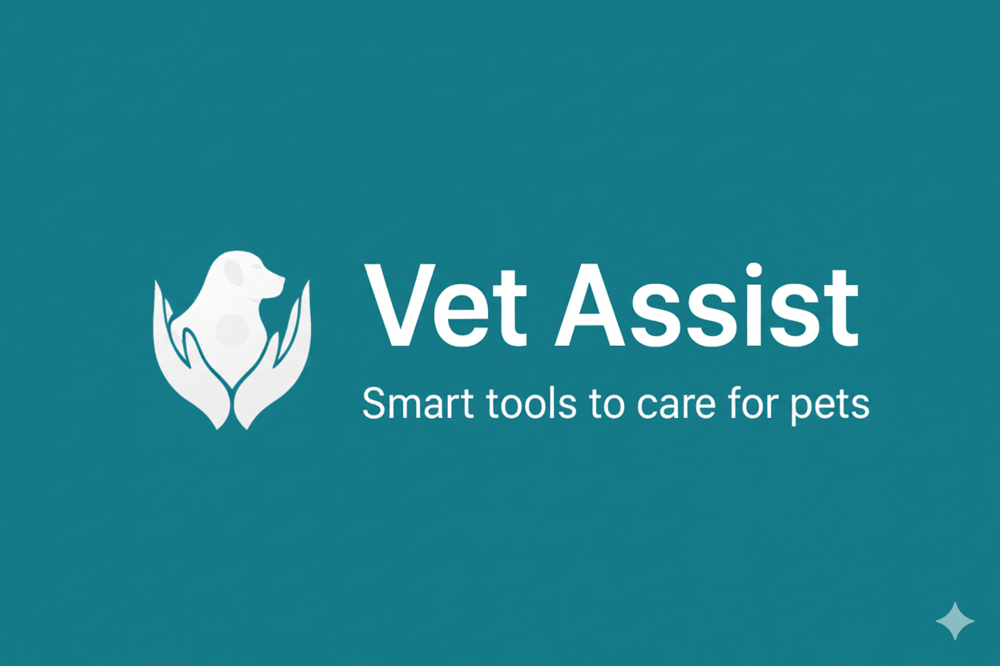
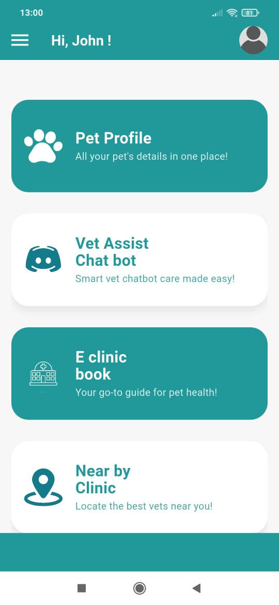
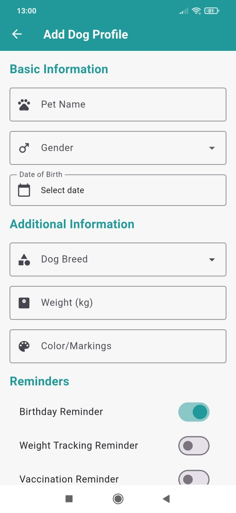
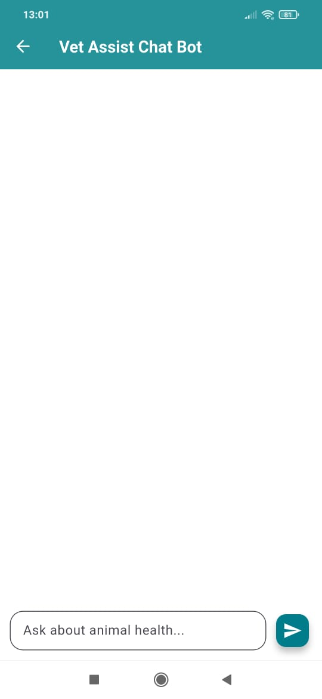
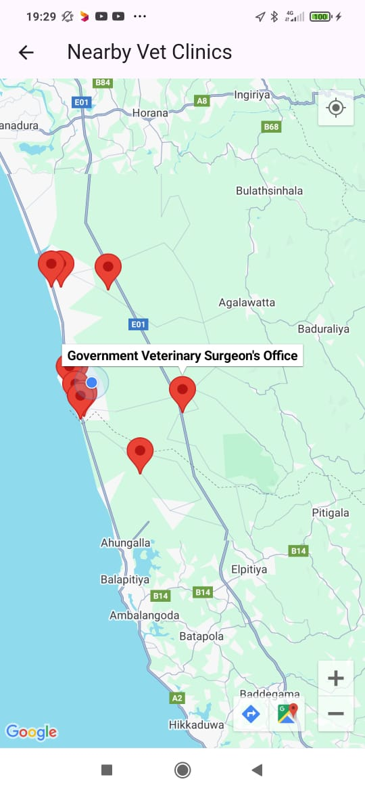

# 🐾 Vet Assist  



[](LICENSE)  
[](https://flutter.dev/)  
[](https://firebase.google.com/)  
[](../../issues)  

**Vet Assist** is a mobile application designed to make pet care easier for owners of **cats and dogs**.  
It provides smart tools such as an **AI chatbot for pet care guidance**, **vaccination and diet planning**, and **geolocation-based vet clinic search** to ensure pets get the care they deserve.  

---

## ✨ Features  

- 👤 **Pet Profiles** – Register pets with details like name, age, breed, and medical history.  
- 🤖 **AI Chatbot** – Get instant advice on diet plans, vaccination schedules, and emergency treatments.  
- 📍 **Nearby Vet Clinics** – Use geolocation to find trusted veterinary clinics around you.  
- 🗂️ **Health Records Management** – Store and track vaccinations, treatments, and medical history.  
- 📅 **Reminders & Notifications** – Stay updated on upcoming vet visits and vaccination dates.  

---

## 🎯 Objectives  

- Help pet owners manage their pets’ health effectively.  
- Provide quick, reliable **AI-powered** answers to common pet care questions.  
- Bridge the gap between pet owners and veterinary professionals using **location-based services**.  

---

## 🛠️ Tech Stack  

- **Frontend:** Flutter (Dart)  
- **Backend & Database:** Firebase (Authentication, Firestore, Cloud Functions, Cloud Messaging)  
- **APIs & Services:**  
  - Firebase Authentication – secure user login  
  - Firebase Firestore – data storage  
  - Firebase Cloud Messaging – push notifications  
  - Geolocation API – nearby vet clinics  
  - AI Chatbot API – pet care assistance  

---

## 📌 System Modules  

1. **User Registration & Authentication**  
2. **Pet Profile Management**  
3. **AI Chatbot (Pet Care Guidance)**  
4. **Vet Clinic Locator**  
5. **Vaccination & Diet Scheduler**  
6. **Notification & Reminder System**  

---

## 📱 Screenshots & Demo  

Here are some previews of the **Vet Assist** app:  

| Home Screen | Pet Profile | AI Chatbot | Vet Clinic Locator |
|-------------|-------------|------------|--------------------|
|  |  |  |  |

---

## 🚀 Getting Started  

### Prerequisites  
- [Flutter SDK](https://docs.flutter.dev/get-started/install) installed  
- Firebase project configured (Firestore, Authentication, Cloud Messaging)  
- Emulator or physical device for testing  

### Installation  
```bash
# Clone the repository
git clone https://github.com/AshaniTH/Vet_Assist.git

# Navigate into the project folder
cd Vet_Assist

# Install dependencies
flutter pub get

# Run the application
flutter run
